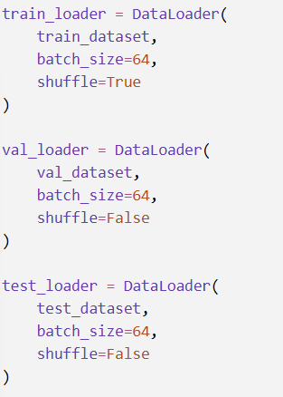

# CNN_image_classification_final_project

# CNN-Based Fashion Image Classification Using PyTorch

## 1. Project Overview

This project implements a Convolutional Neural Network (CNN) for image classification using PyTorch.

The primary objective of this project is to train a CNN model on the Fashion-MNIST dataset and evaluate its performance on the standard test dataset. In addition, the trained model is tested on 10 real-world photographs captured using a smartphone.

The project demonstrates a complete deep learning workflow, including dataset acquisition, image preprocessing, model development, training, validation, evaluation, model saving, real-world prediction, and error analysis.

The project was developed using Python and PyTorch and executed in Google Colab.

## 2. Objectives

The main objectives of this project are:

- To implement a CNN using PyTorch.
- To train the CNN on the Fashion-MNIST dataset.
- To perform appropriate image preprocessing.
- To divide the training data into training and validation sets.
- To evaluate the model using the standard Fashion-MNIST test dataset.
- To visualize training and validation performance.
- To generate a confusion matrix.
- To test the trained model on real-world smartphone images.
- To analyze incorrectly classified test images.
- To save and organize the trained model and project files in a GitHub repository.

These objectives follow the requirements of the assignment, including standard-dataset training followed by real-world testing using custom photographs. :contentReference[oaicite:1]{index=1}

## 3. Dataset

### 3.1 Fashion-MNIST

The model is trained using the Fashion-MNIST dataset, obtained directly through `torchvision.datasets`.

Fashion-MNIST contains grayscale images belonging to 10 different clothing and fashion categories.

The classes are:

| Label | Class |
|------:|-------|
| 0 | T-shirt/top |
| 1 | Trouser |
| 2 | Pullover |
| 3 | Dress |
| 4 | Coat |
| 5 | Sandal |
| 6 | Shirt |
| 7 | Sneaker |
| 8 | Bag |
| 9 | Ankle boot |

The dataset contains 60,000 training images and 10,000 test images. Each image has a resolution of 28 × 28 pixels and is represented as a grayscale image.

### 3.2 Custom Smartphone Dataset

For real-world evaluation, 10 photographs of fashion-related objects were captured using a smartphone.

The custom images are stored in the `dataset/` directory of this repository.

The custom dataset contains examples corresponding to the Fashion-MNIST classes selected for the real-world testing task.

The images were placed on a relatively plain background to reduce unnecessary visual noise before being photographed.

According to the assignment requirements, the custom images are processed to match the format of the training data, including grayscale conversion and resizing to 28 × 28 pixels. :contentReference[oaicite:2]{index=2}

### Custom Dataset Structure
dataset/
├── sandal.jpg
├── sandal2.jpg
├── bag.jpg
├── bag2.jpg
├── sneaker.jpg
├── sneaker2.jpg
├── tshirt.jpg
├── tshirt2.jpg
├── trouser.jpg
└── trouser2.jpg
loss.backward(), and optimizer.step().

