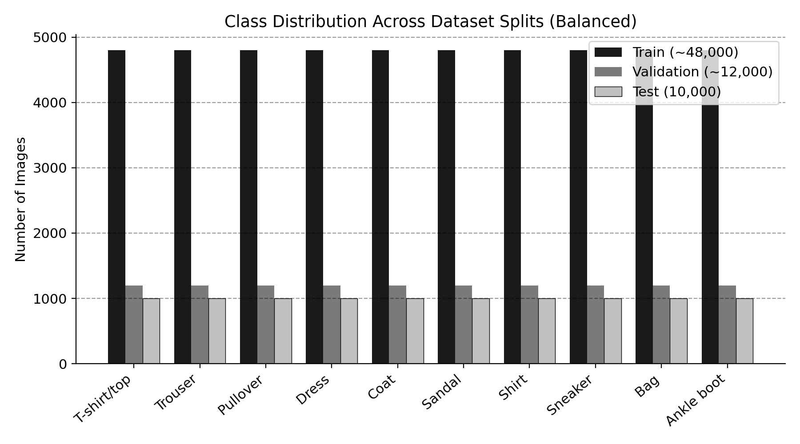
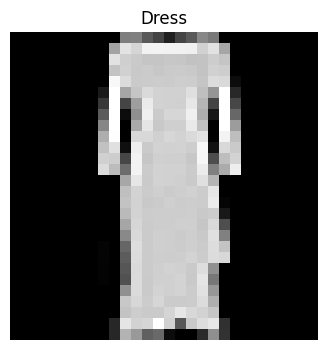
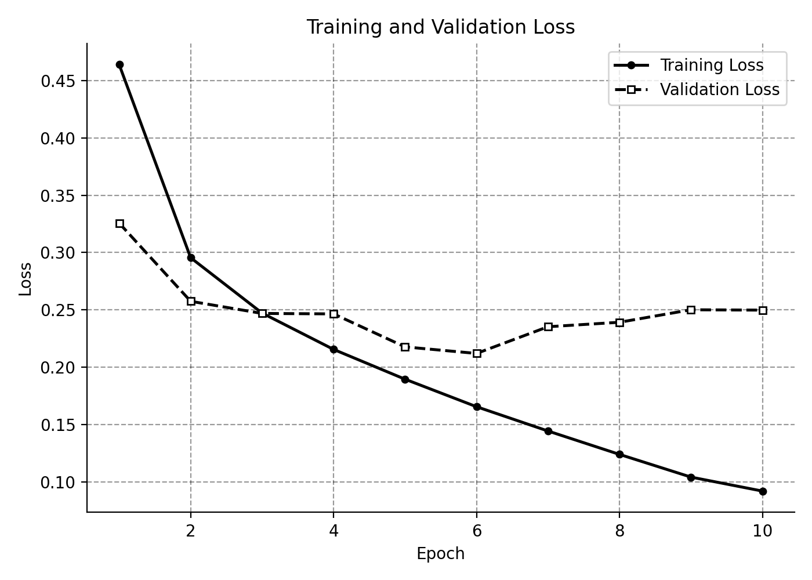
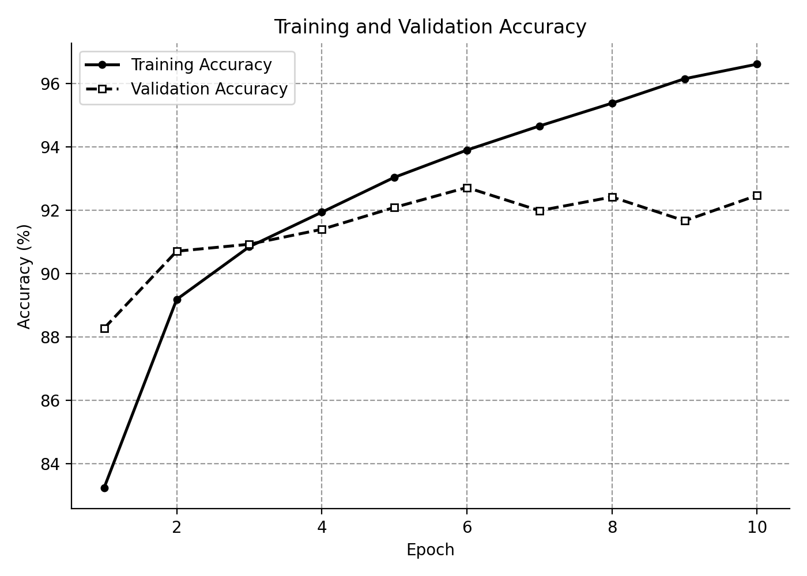
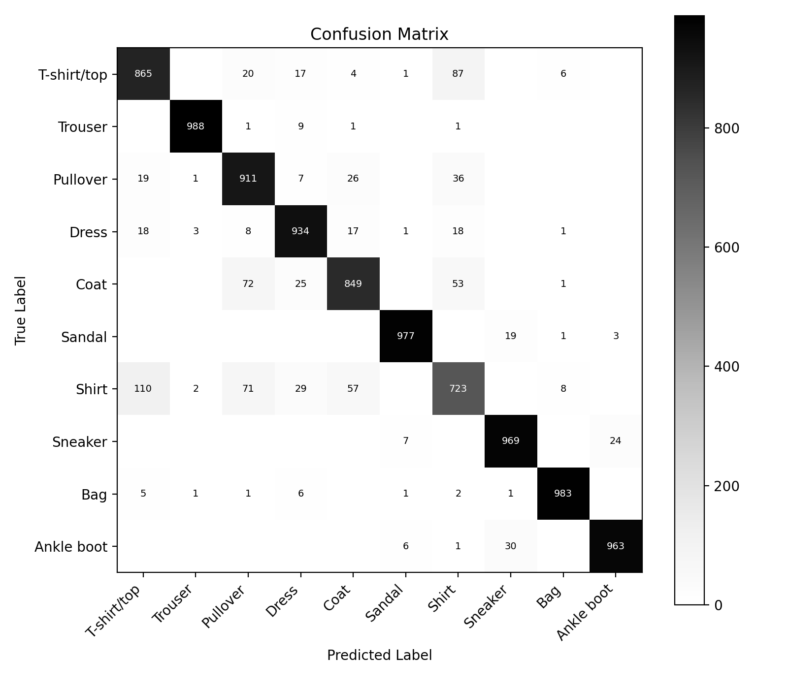
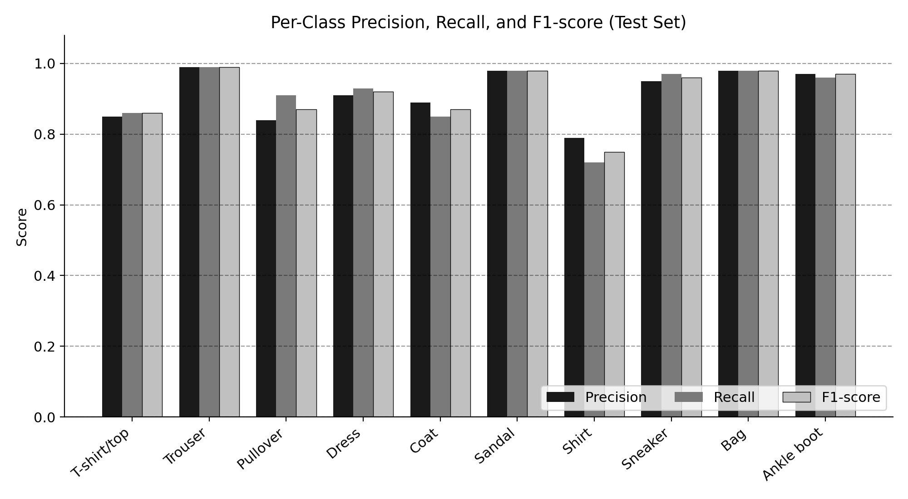
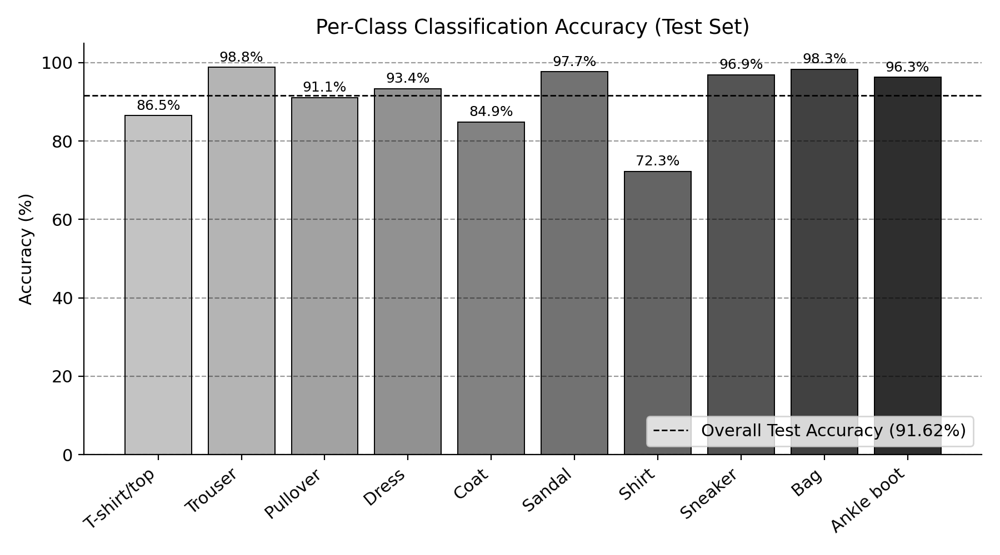
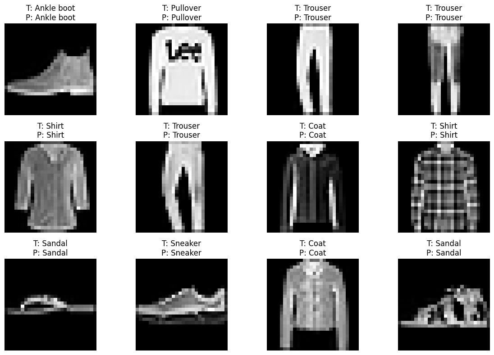
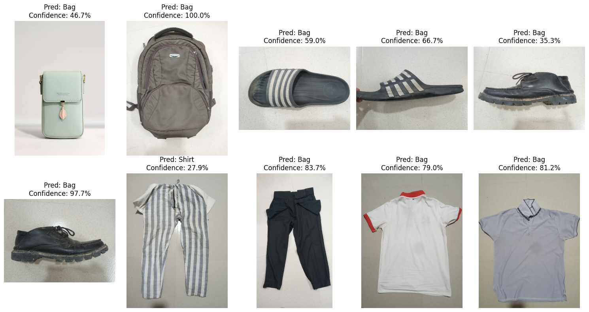

# Fashion-MNIST Image Classification with CNN

A Convolutional Neural Network (CNN) built in **PyTorch** to classify clothing images from the **Fashion-MNIST** dataset into 10 categories. The model is trained, evaluated on a held-out test set, and further stress-tested on custom real-world photos to study its generalization limits.

---

##  Overview

This project implements an end-to-end image classification pipeline:

- Loads and preprocesses the Fashion-MNIST dataset
- Trains a custom 2-block CNN from scratch (no pretrained weights)
- Tracks training/validation loss and accuracy across epochs
- Evaluates on the test set with a confusion matrix and classification report
- Tests the trained model on **custom real-world clothing photos** to analyze the train/real-world domain gap

| Metric | Score |
|---|---|
| Training Accuracy | **96.61%** |
| Validation Accuracy | **92.47%** |
| Test Accuracy | **91.62%** |

---

##  Dataset

[Fashion-MNIST](https://github.com/zalandoresearch/fashion-mnist) — 70,000 grayscale, 28×28 images across 10 clothing classes.

| Label | Class |
|---|---|
| 0 | T-shirt/top |
| 1 | Trouser |
| 2 | Pullover |
| 3 | Dress |
| 4 | Coat |
| 5 | Sandal |
| 6 | Shirt |
| 7 | Sneaker |
| 8 | Bag |
| 9 | Ankle boot |

Split used: **48,000 train / 12,000 validation / 10,000 test**.

<p align="center">
  <br>
  <em>Class distribution across train/validation/test splits</em>
</p>

<p align="center">
  <br>
  <em>Sample preprocessed training image</em>
</p>

---

##  Model Architecture

```
Input (1×28×28)
   │
Conv2D(1→32, 3×3, pad=1) → ReLU → MaxPool(2×2)     → 32×14×14
   │
Conv2D(32→64, 3×3, pad=1) → ReLU → MaxPool(2×2)    → 64×7×7
   │
Flatten                                             → 3136
   │
Linear(3136→128) → ReLU
   │
Linear(128→10)                                      → 10 class logits
```

**Training config:**
- Loss: Cross-Entropy Loss
- Optimizer: Adam (`lr=0.001`)
- Batch size: 64
- Epochs: 10

---

## Results

### Training curves
Training loss decreases steadily; validation loss plateaus after epoch ~5–6, indicating mild overfitting in later epochs.

<p align="center">
  
  
</p>

### Confusion matrix

<p align="center">
  
</p>

### Per-class performance (test set)

| Class | Precision | Recall | F1-score |
|---|---|---|---|
| T-shirt/top | 0.85 | 0.86 | 0.86 |
| Trouser | 0.99 | 0.99 | 0.99 |
| Pullover | 0.84 | 0.91 | 0.87 |
| Dress | 0.91 | 0.93 | 0.92 |
| Coat | 0.89 | 0.85 | 0.87 |
| Sandal | 0.98 | 0.98 | 0.98 |
| Shirt | 0.79 | 0.72 | 0.75 |
| Sneaker | 0.95 | 0.97 | 0.96 |
| Bag | 0.98 | 0.98 | 0.98 |
| Ankle boot | 0.97 | 0.96 | 0.97 |

<p align="center">
  
  
</p>

**Key finding:** most confusion happens between visually similar upper-body garments (Shirt, T-shirt, Pullover, Coat), while shape-distinctive classes (Trouser, Sandal, Bag) are classified almost perfectly.

### Qualitative predictions on test images

<p align="center">
  
</p>

---

## 🌍 Real-World Generalization Test

The trained model was also tested on 10 custom photographs of real clothing items. Despite strong benchmark accuracy, it performed poorly on these out-of-distribution images (frequently predicting "Bag"), highlighting a **domain-shift gap** between clean benchmark data and real-world photos (background clutter, lighting, framing, resolution loss).

<p align="center">
  
</p>

See `report.pdf` for the full analysis of this generalization gap.

---

##  Repository Structure

```
.
├── README.md
├── 220150_CNN.ipynb        # Full notebook: data loading, model, training, evaluation
├── dataset/                 # Fashion-MNIST data (downloaded via torchvision)
├── model/                   # Saved trained model weights (220150.pth)
├── report.pdf               # Detailed lab report (theory, results, analysis)
├── report.tex                # LaTeX source of the report
└── imgs/imgs/                # All images used in this README
    ├── sample_image.png
    ├── class_distribution.png
    ├── loss_curve.png
    ├── accuracy_curve.png
    ├── confusion_matrix.png
    ├── per_class_metrics.png
    ├── per_class_accuracy.png
    ├── test_predictions_grid.png
    └── custom_predictions.png
```

> **Note:** image paths above use `imgs/imgs/...` to match this repo's current folder layout. If you later flatten that folder to a single `imgs/`, update the `src="imgs/imgs/..."` paths in this file to `src="imgs/..."`.

---

##  Getting Started

### Requirements
```bash
pip install torch torchvision matplotlib numpy pillow scikit-learn
```

### Run
```bash
jupyter notebook 220150_CNN.ipynb
```
The Fashion-MNIST dataset is downloaded automatically via `torchvision.datasets.FashionMNIST` on first run.

### Use the saved model
```python
import torch
from model_def import CNN  # or wherever the CNN class is defined

model = CNN()
model.load_state_dict(torch.load("model/220150.pth", map_location="cpu"))
model.eval()
```

---

##  Future Improvements

- Add dropout / batch normalization to reduce overfitting
- Data augmentation (flips, rotations, translations) for better generalization
- Fine-tune on real-world photos to close the domain gap
- Experiment with deeper architectures (ResNet-style blocks)


This project is open-sourced under the [MIT License](LICENSE).

